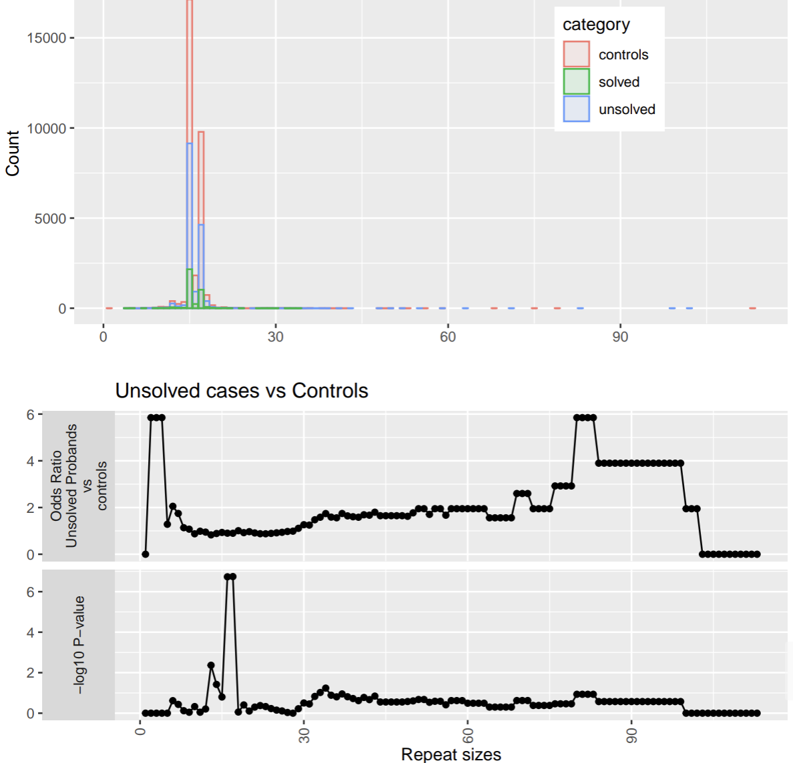

R script for searching labkey on GEL and annotating/curating cohorts with the aim of designing datasets for hypothesis testing

It does so by creating an SQL statement to join and merge all possible data- from 100k and GMS:
```
sql_str <- paste0("
    SELECT pa.sample_id AS plate_key, pa.participant_id,
           p.participant_phenotyped_sex AS gender,
           p.yob AS year_of_birth,
           p.genetically_inferred_ancestry_thr AS ancestry
    FROM panels_applied pa
    LEFT JOIN rare_diseases_participant_phenotype rd ON pa.participant_id = rd.participant_id
    LEFT JOIN participant_summary p ON pa.participant_id = p.participant_id
    WHERE pa.sample_id IN ('LP300000','LP300001'....);
  ")
  
  result <- labkey.executeSql(
    baseUrl = "...",
    folderPath = "...",
    schemaName = "lists",
    sql = sql_str
  )
```

Example of use:
```
Rscript curate_dataset.R -l input.tsv -merge_by participant_id
```

Options include


```
("-d", "--disease") "Disease term by which to define a row as case or control by (e.g., 'hypertension')- see readme for how to specify"
("-l", "--list") "file with list of patients (in the first column) that need to be annotated- output annotations will be merged to this file (including other columns)- if none is supplied all patients in 'panels_applied' will be annotated"
("-m", "--merge_by") "If the supplied --list input file needs to be searched according to a column other than the first one- please input that column name here"
("-o", "--output") "output file into which the data will be put- default is 'out.tsv'"
("-c", "--control_age_cutoff") "Year of birth at which to remove controls- defined according to '--disease'"
("-p", "--get_paths") "option to get paths to cram files and genome versions- default = TRUE"
("-n", "--number") "option to take first n rows in from '--list' option"
("-a", "--annotate") "option to annotate rows with disease according to 'panels applied, phenotype and hpo terms'"
("-e", "--cancer_genomes") "include cancer genomes as controls"
("-k", "--order_by") "order the input and output file according to a particular column- specify column name"
("-s", "--suffix")" remove suffix of column on which search is being performed"
("-r", "--prefix") "remove prefix of column on which search is being performed", metavar = "character")
```

Define cases and controls according to a criteria:
```
Rscript curate_dataset.R --disease "panel_name=Hereditary ataxia,phenotype contains epilepsy,normalised_hpo_term contains intellectual disability,code_description contains mitochondrial"
```

If the sex yob and ancestry alone are required for a list of samples (selecting by participant_id- as opposed to plate_key):
```
Rscript curate_dataset.R -l input.tsv -merge_by participant_id -a F
```

If the list of samples is in a column where a suffix/ prefixt needs to be removed:
```
Rscript curate_dataset.R -l input.tsv --prefix "/path/to/data/" --suffix ".bam"
```

If you want the data for the top 10 rows (ranked according to some column e.g. repeat sie):
```
Rscript curate_dataset.R -l input.tsv -n 10 -k repeat_size
```


`andrew_sharp_plots.R` enables one to examine the enrichment of cases for a given disease at with mutation of interest e.g. a repeat expansion:
```
source('/re_gecip/shared_allGeCIPs/AT_CC/GMS_and_100K_combined/andrew_sharp_plots/andrew_sharp_plots.R')
for(gene in c('BALAP','ADARB1','BCLAF3','E2F4','KCNN3','MEF2A','ZNF384')){
    g=sharp_plot_delia_latest(
        repeat_size_data=paste0('/re_gecip/neurology/Kristina/research/MIAMI/chris_tables/',gene,'_100K_and_GMS_cases.tsv'),
        control_data=paste0('/re_gecip/neurology/Kristina/research/MIAMI/chris_tables/',gene,'_100K_and_GMS_controls.tsv'),
        gene,'gene',LongAllele_col='a2',case_solved_col='Case.Solved.Family',
        include_ci=F,handle_infinite_values='set to maximum',log10=T,
        start_from=0,export_used_data=TRUE)
    png(paste0(gene,'_log.png'))
    print(ggarrange(g$hist_plot,g$unsolved_vs_solved_plot,g$unsolved_vs_controls_plot,ncol=1))
    dev.off()
}
```
Example figure:



